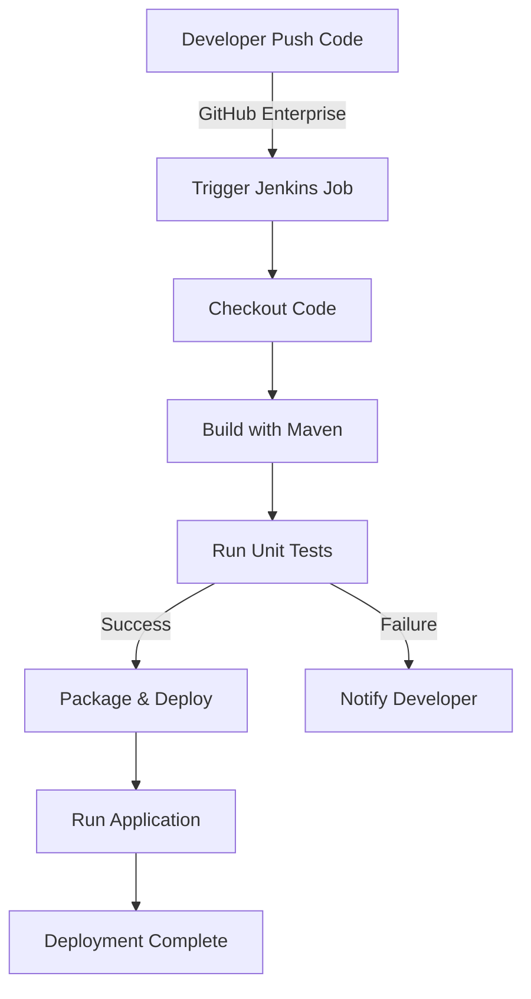

# Java Maven Jenkins Project

This is a simple Java application built with Maven and deployed using Jenkins.

## Project Structure
```
java-maven-jenkins/
│── src/
│   ├── main/java/com/example/App.java
│   ├── test/java/com/example/AppTest.java
│── pom.xml
│── Jenkinsfile
│── README.md
```

## CI/CD Flow Overview
The project follows an end-to-end CI/CD pipeline using Jenkins. Below is the high-level flow diagram:



## CI/CD Pipeline Stages
1. **Checkout** – Jenkins pulls the latest code from GitHub Enterprise.
2. **Build** – The project is built using Maven.
3. **Test** – Runs unit tests using JUnit.
4. **Package & Deploy** – If tests pass, the application is packaged.
5. **Run Application** – Runs the built application.
6. **Notify** – If any stage fails, Jenkins sends a failure notification.

## Build & Run Locally

### Using Maven
```sh
mvn clean install
java -cp target/java-maven-jenkins-1.0-SNAPSHOT.jar com.example.App
```

### Running the Jenkins Pipeline
The Jenkinsfile contains the pipeline script to build and run the project.

```groovy
pipeline {
    agent any
    stages {
        stage('Checkout') {
            steps {
                git 'https://github.com/your-repo/java-maven-jenkins.git'
            }
        }
        stage('Build') {
            steps {
                sh 'mvn clean install'
            }
        }
        stage('Test') {
            steps {
                sh 'mvn test'
            }
        }
        stage('Run') {
            steps {
                sh 'java -cp target/java-maven-jenkins-1.0-SNAPSHOT.jar com.example.App'
            }
        }
    }
}
```

## Technologies Used
- **Java 17** – Programming language
- **Maven** – Build and dependency management
- **JUnit** – Unit testing framework
- **Jenkins** – CI/CD automation
- **GitHub Enterprise** – Source code repository

## Future Improvements
- Integrate with SonarQube for code quality analysis.
- Deploy to a cloud platform (AWS, Azure, GCP).
- Add containerization with Docker and Kubernetes.

### Author: Chandra 🚀